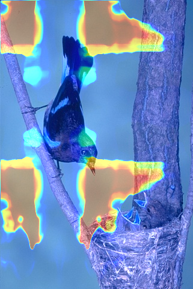

## Heatmap calculation

```python
torchrun --nproc_per_node=8  --nnodes=1  comp_hw.py --images_dir ../tetris/datasets/FOR_TEST/images  --masks_dir ../tetris/datasets/FOR_TEST/masks/  --output_dir computed_test_comp_boxes/SAM/FOR_TEST/ --batch_size 512 --checkpoint_path ../tetris/MODEL_CHECKPOINTS/SAM/sam_vit_b_01ec64.pth   --model_name SAM
```

Parameters description:

```
--images/masks \*\_dir - directories of \*.png files with the same stems.
--model_name used for matching of model loading function

```

Caution: Heatmaps calculation uses a lot of gpu resources, running W\*H forward calls of the model. User is advised to adjust batch_size and nproc_per_node params.

## Heatmap visualisation

Running the script above will produce "res_final_{image stem}.csv" tables that contain bbox coordinates and IoU@BBox metric obtained from model prediction from respective bbox prompt.

```python
python draw_heatmaps.py --dataset_names FOR_TEST --input_data computed_bboxes/SAM/ --num_workers 32
```

Here is the example of heatmap obtained after running the scripts above:


---
